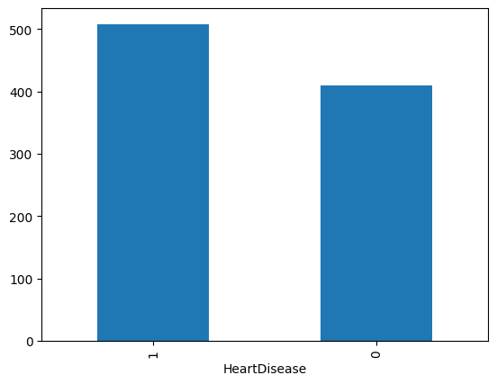
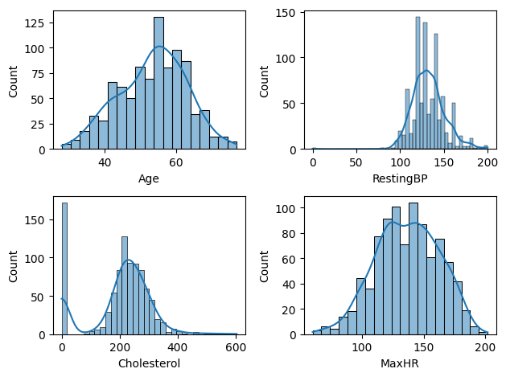
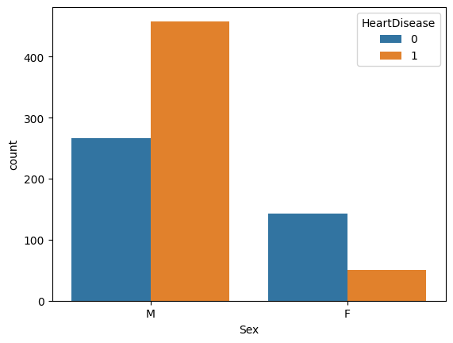
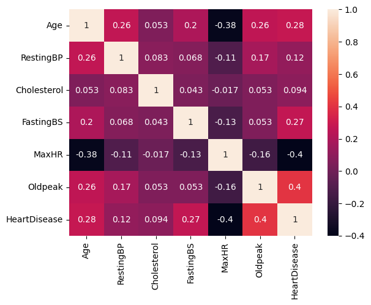

# Heart Disease Prediction

This repository contains a heart disease prediction project built from a Jupyter notebook workflow and a lightweight Streamlit app. The notebook handles data cleaning, visualization, feature engineering, and model training. The app uses the saved model artifacts to predict whether a case is high or low risk.

## Model Used

The final model used in this project is KNN (K-Nearest Neighbors).

## Other Models Tried

- Logistic Regression - accuracy: 0.8696, F1 score: 0.8857
- KNN - accuracy: 0.8641, F1 score: 0.8815
- Naive Bayes - accuracy: 0.8533, F1 score: 0.8683
- Decision Tree - accuracy: 0.7717, F1 score: 0.7941
- SVM - accuracy: 0.8478, F1 score: 0.867

## Project Files

- [app.py](app.py) - Streamlit app entry point
- [heart.ipynb](heart.ipynb) - notebook for exploration, preprocessing, training, and model export
- [KNN_heart.pkl](KNN_heart.pkl) - trained KNN classifier
- [scaler.pkl](scaler.pkl) - fitted scaler used during preprocessing
- [columns.pkl](columns.pkl) - feature order used by the model

## Notebook Visualizations

The notebook includes several important plots that describe the dataset and target distribution.

### Target Class Distribution

### Feature Histograms

### Sex vs Heart Disease

### Correlation Heatmap

## Project Summary

- Data exploration is done in the notebook.
- Model artifacts are saved as pickle files in the project folder.
- The Streamlit app uses those saved artifacts to make predictions from user inputs.
